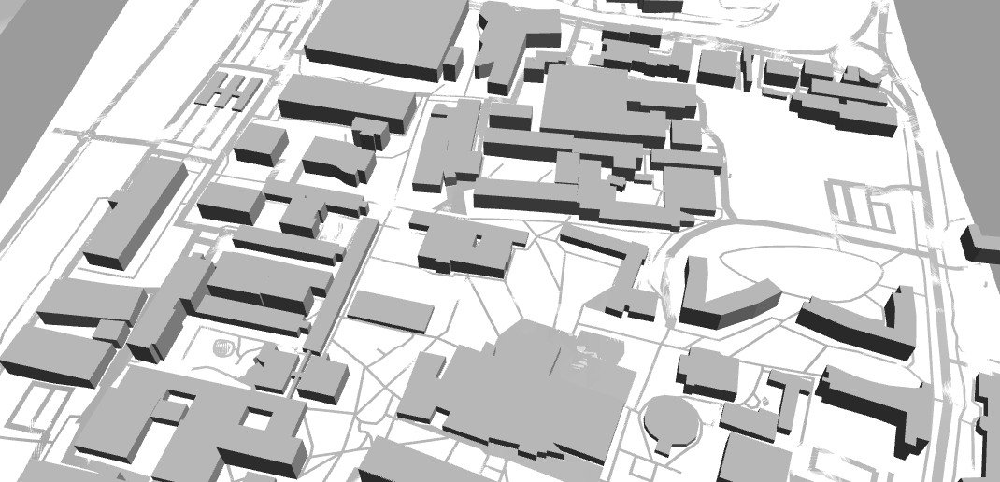
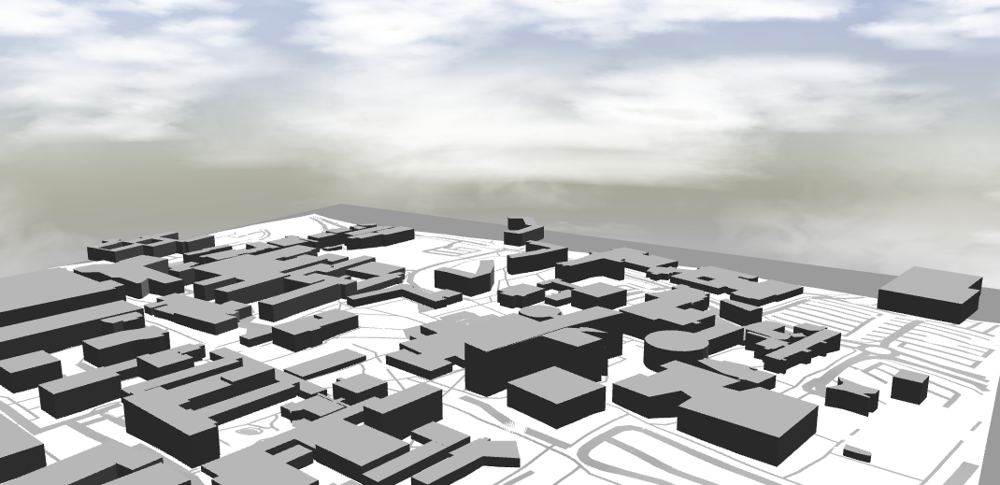
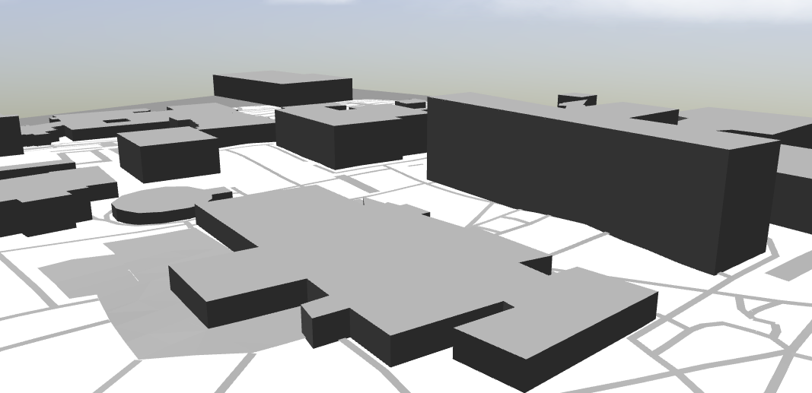

# Gazebo Environment Modelling
Using OSM/Blender/SDF to model a university campus environment in Gazebo simulator.

## Results
Progress as at 29/4/20:

<table>
  <tr>
    <td align="center"></td>
    <td align="center"></td>
  </tr>
  <tr>
    <td align="center"></td>
    <td align="center"></td>
  </tr>
 </table>

 Brief video panning around the environment can be found [here](https://drive.google.com/file/d/1VPEr-8XoI3cyhbaqOAlo3Q8IAjtr_Tpw/view?usp=sharing "Model Video").

## Testing:
1. Terminal: git clone https://github.com/cgia10/Gazebo-Environment-Modelling.git
2. Add the /Models/ directory in this repo to the GAZEBO_MODEL_PATH environment variable
    1. In terminal: source "your gazebo install path"/share/gazebo/setup.sh
    2. In terminal: sudo nano "your gazebo install path"/share/gazebo/setup.sh
    3. Add the path to this repo's /Models/ directory. Enter the path in the line with the GAZEBO_MODEL_PATH variable, after the colon. Finish the path with another colon.
3. cd into the root of this repo
4. In terminal: gazebo campus.world
