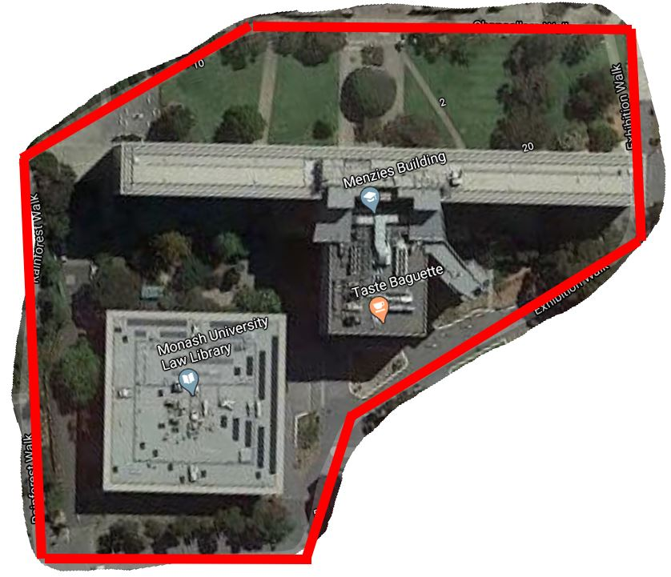
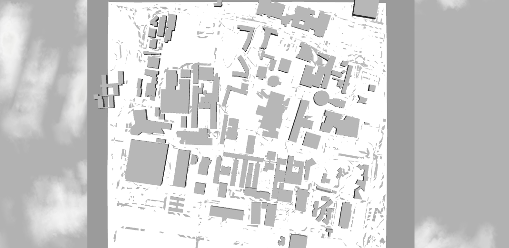
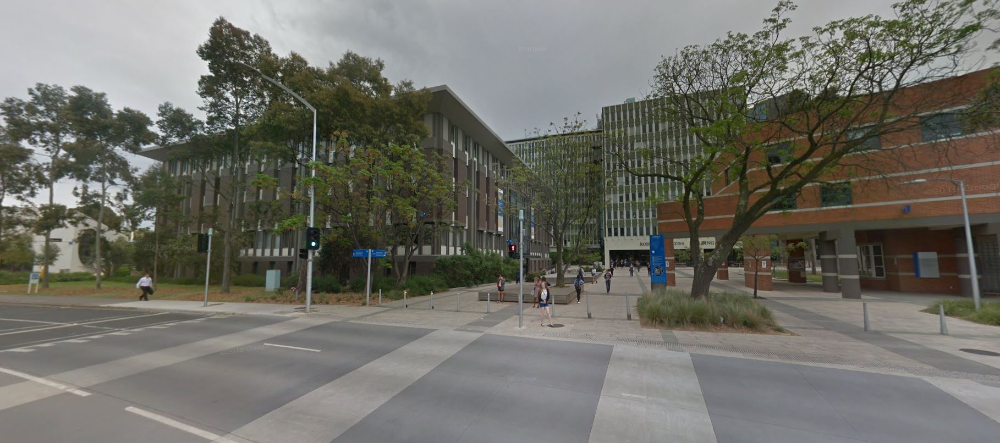
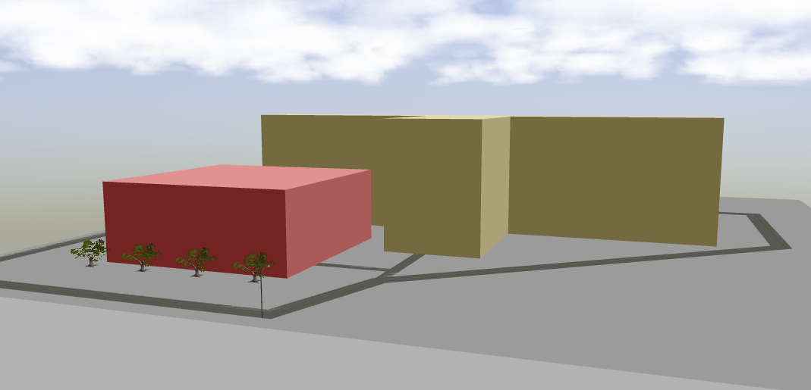
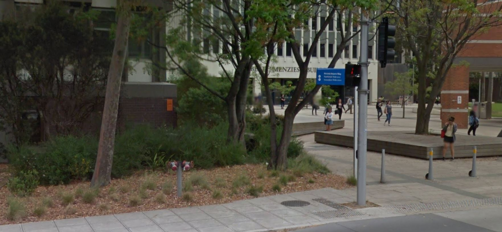
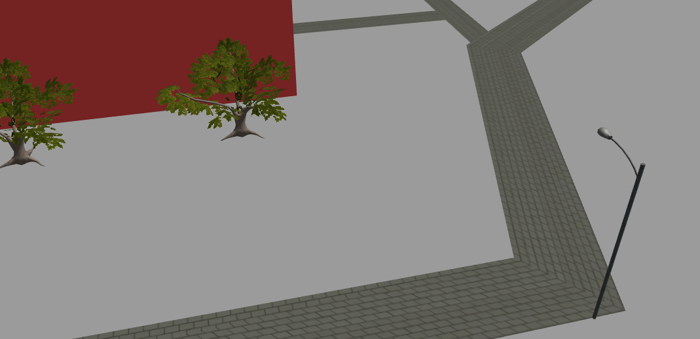

# Gazebo Environment Modelling
Using SDF to model a university campus environment in Gazebo simulator.

## Aim
Aiming to model the following section of campus:

## Results
Progress as at 22/4/20:

<table>
  <tr>
    <td align="center"></td>
    <td align="center"></td>
  </tr>
  <tr>
    <td align="center"></td>
    <td align="center"></td>
  </tr>
  <tr>
    <td align="center"></td>
    <td align="center"></td>
  </tr>
 </table>

## Testing:
1. Terminal: git clone https://github.com/cgia10/Gazebo-Environment-Modelling.git
2. Add the /Models/ directory in this repo to the GAZEBO_MODEL_PATH environment variable
    1. Terminal: source "your gazebo install path"/share/gazebo/setup.sh
    2. Terminal: sudo nano "your gazebo install path"/share/gazebo/setup.sh
    3. Add the path to this repo's /Models/ directory. Enter the path in the line with the GAZEBO_MODEL_PATH variable, after the colon. Finish the path with another colon.
3. cd into the root of this repo
4. Terminal: gazebo campus_menzies_lawbry.world
